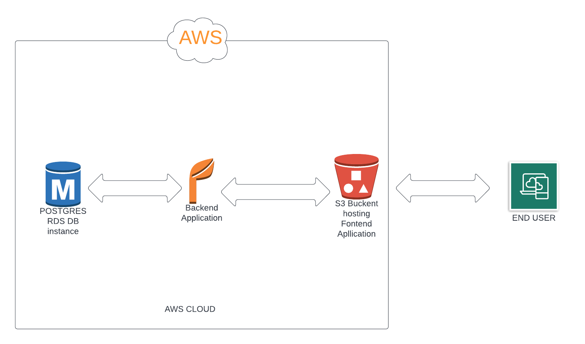

## AWS SERVICES
##### AWS RDS
Amazon Relational Database Service (RDS) is a collection of managed services that makes it simple to set up, operate, and scale relational databases in the cloud.
**RDS** provide us with the following benifits:

- Easy Deployment. Amazon RDS allows you to use either the AWS Management Console or a set of APIs to create, delete, and modify your database instances.
- Fast Storage Options.
- Backup & Recovery.
- High Availability.
- Monitoring/Metrics.
- Security.
  
In this project, **POSTGRES** database engine is used to store the relational data that should be stored as it is one of the best databases outthere.
**Postgres** allows you to store large and sophisticated data safely. It helps developers to build the most complex applications, run administrative tasks and create integral environments
RDS holds all applocation data of posts and users.
##### AWS S3
Amazon Simple Storage Service (Amazon S3) is an object storage service that offers industry-leading scalability, data availability, security, and performance.
**S3** benefits:
- Storage logging and monitoring
- Analytics and insights
- Strong consistency
- Data processing
- Access management

In this project , **S3** is used to host our frontend application by letting the s3 bucket to being publically accessible and enabling **Static Hosting** 
This where our users will interact with our application.

##### AWS Elasticbeanstalk
AWS Elastic Beanstalk is an easy-to-use service for deploying and scaling web applications and services developed with Java, .NET, PHP, Node.js, Python, Ruby, Go, and Docker on familiar servers such as Apache, Nginx, Passenger, and IIS.
You can simply upload your code and Elastic Beanstalk automatically handles the deployment, from capacity provisioning, load balancing, auto-scaling to application health monitoring. At the same time, you retain full control over the AWS resources powering your application and can access the underlying resources at any time.

In this project, **EB** is used for deploy our backend server built with nodejs running on linux platform.
**EB** hosts the server application through which rds postgres database could be queried and data fetched from api can be sent to frontend application